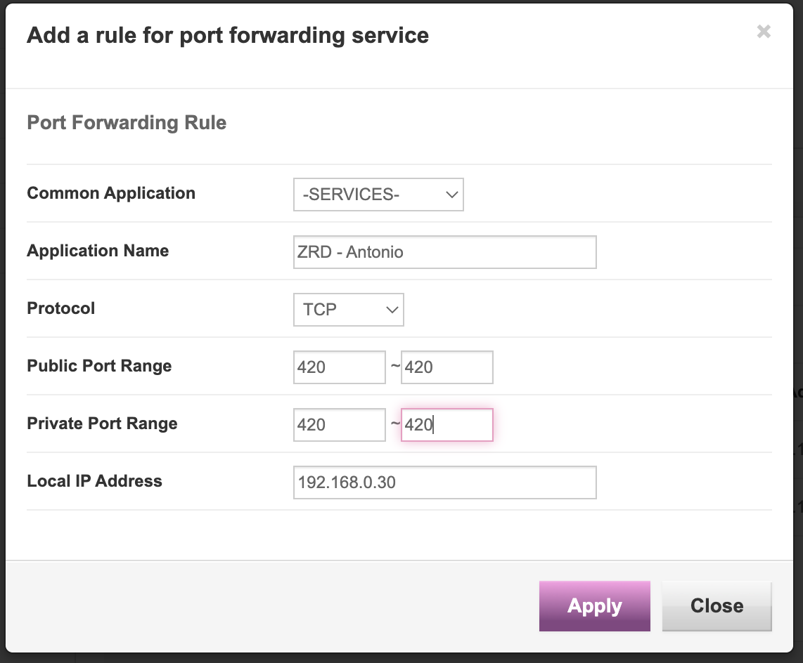

# Peer2Peer Support for ZRD
In order for ZRD to be truly decentralised, it needs to handle storage and deployment through peer-2-peer networking.

# Technical Implementation
The p2p network will be implemented through direct TCP connections between nodes.
The TCP connections between nodes will manage :
- Sharing Blockchain state data bi-directional (full blockchains, light blockchains)
- New transaction posting (from lightweight nodes to full nodes)
- Other ? (to consider)

# Networking
Due to the direct TCP connections made between nodes, a node must know the IP and open port on the peer node.

In practice, most nodes will be end-user PCs, which most of the time sit behind firewalls. This means that the peer node's IP Address will be a router NAT EXT IP.
The implication is that when a peer A from outside peer B's network is trying to connect to peer B, it will need to find the private IP and port through the NAT EXT IP.

There are a few solutions to this problem :
1. Hole Punching {Res.1}
2. Port Forwarding Config on Router or Firewall level - **expensive, ZRD wants as less low level configs as possible on external devices**

## Hole Punching
Currently not implemented.

## Port Forwarding
For educational and starting point purposes, 
I set up port forwarding on my router from public port 420 to private port 420.

Basically, TCP connections from external networks to the public EXT IP (usually router EXT NAT) and port (420 in the screenshot above) will be forwarded to the local IP on the private port.

# Resources
1. https://en.wikipedia.org/wiki/Hole_punching_%28networking%29
2. https://www.c-sharpcorner.com/article/building-a-blockchain-in-net-core-p2p-network/